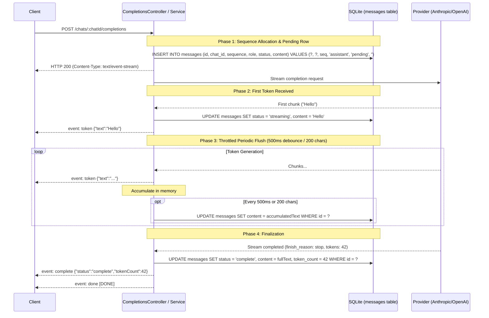

# RFC: Realtime Transport for Streaming Completions and Live Updates

- **Status**: Proposed / Accepted
- **Author**: Nathan Schmid
- **Issue**: [#23](https://github.com/Open-Glassbeetle/glassbeetle/issues/23)
- **Target Audience**: Backend engineers, frontend engineers implementing chat UI, multi-agent orchestration contributors

---

## 1. Executive Summary

This RFC decides the realtime transport mechanism for the Glassbeetle API (`apps/api`).

**Decision**: **Server-Sent Events (SSE) over HTTP** is adopted as the sole realtime transport for streaming completions, multi-agent conversations, and progress notifications. WebSockets are rejected for the current architecture.

**Key Reasons**:
1. **Zero New Dependencies**: NestJS natively supports SSE via `@Sse()` and RxJS `Observable`. Glassbeetle already depends on `rxjs`; no additional packages (such as `@nestjs/websockets`, `@nestjs/platform-ws`, or `socket.io`) are required.
2. **Standard Pipeline Composition**: SSE requests pass through the standard Express/Nest HTTP pipeline, preserving request-scoped correlation IDs (`X-Request-Id`), request logging middleware, CORS allowlists, and validation pipes.
3. **Desktop Local-First Alignment**: Glassbeetle is a local single-user desktop application communicating over loopback (`127.0.0.1`). Network constraints that typically drive cloud WebSocket adoption (proxy timeouts, aggressive mobile carrier disconnects, NAT traversal) do not exist.
4. **Structured Protocol**: A lightweight JSON-event wire format handles single-agent completions, multi-agent team turns, and in-band error reporting with atomic SQLite persistence guarantees.

---

## 2. Motivation & Context

The database schema committed to realtime streaming behavior from day one. In `data/chats/messages.sql`:

```sql
CREATE TABLE messages (
    id           TEXT PRIMARY KEY,
    chat_id      TEXT NOT NULL REFERENCES chats(id) ON DELETE CASCADE,
    sequence     INTEGER NOT NULL,
    role         TEXT NOT NULL CHECK (role IN ('user', 'assistant', 'system', 'tool')),
    agent_id     TEXT REFERENCES agents(id) ON DELETE SET NULL,
    content      TEXT NOT NULL,
    status       TEXT NOT NULL DEFAULT 'complete' CHECK (status IN (
                    'pending', 'streaming', 'complete', 'error'
                 )),
    token_count  INTEGER,
    created_at   TEXT NOT NULL,
    UNIQUE (chat_id, sequence)
);
```

The `'pending'` and `'streaming'` statuses require partial output to reach the client as it is generated by upstream LLM providers (Anthropic, OpenAI, local Ollama, etc.).

Downstream issues directly depend on this transport decision:
- Streaming completions (`POST /chats/:chatId/completions`)
- Multi-agent team orchestration (multiple agents taking turns in a single conversation cycle)
- Background progress reporting (model downloads, backup creation, database migrations)

Establishing this architecture up front prevents fragmented implementations or redundant gateway layers.

---

## 3. Evaluation of Options

### Option 1: Server-Sent Events (SSE) over HTTP

Server-Sent Events provide a unidirectional, text-based stream (`Content-Type: text/event-stream`) over a standard HTTP connection. In NestJS, SSE is implemented using the `@Sse()` decorator, which returns an RxJS `Observable<MessageEvent>`.

- **Strengths**:
  - **Zero new dependencies**: Built directly into NestJS core and standard HTTP.
  - **Native HTTP pipeline integration**: Request correlation logging (`X-Request-Id`), error logging, and CORS allowlisting apply identically to standard REST endpoints.
  - **Natural request-response semantic**: Initiating a completion is fundamentally a client command (`POST /chats/:chatId/completions`) that yields a stream of tokens until generation completes.
  - **Browser native**: Handled cleanly by standard Web APIs (`fetch` with `ReadableStream` or `EventSource`).
  - **Stateless & resilient**: No persistent gateway server state machine, heartbeats, or connection pools to maintain.
- **Weaknesses**:
  - **Unidirectional**: Server can only push to client; client commands must be sent as separate HTTP requests.
  - **HTTP/1.1 Connection Limits**: Browsers historically cap concurrent HTTP/1.1 connections per host to ~6.
  - **In-band error constraints**: Once HTTP `200 OK` headers are flushed, subsequent failures cannot change the HTTP status code.

### Option 2: WebSockets (`@nestjs/websockets` + `ws` / `socket.io`)

WebSockets upgrade an HTTP connection to a full-duplex TCP stream, allowing bidirectional messaging over a persistent socket connection.

- **Strengths**:
  - **Full duplex & bidirectional**: Client and server can push messages simultaneously over a single connection.
  - **Multiplexed single connection**: One persistent socket handles all chats, notifications, and background tasks, bypassing the HTTP/1.1 per-host connection limit.
  - **Ambient push**: Trivial to push unsolicited events not initiated by a client request.
- **Weaknesses**:
  - **Heavy dependencies**: Requires installing `@nestjs/websockets`, `@nestjs/platform-ws` (or `socket.io`), and associated typings.
  - **Pipeline bifurcation**: WebSockets bypass standard Express middleware (`RequestLoggingMiddleware`), HTTP interceptors, `HttpExceptionFilter`, and validation pipes. All logging, validation, and error envelopes must be re-implemented as gateway filters and guards.
  - **CORS & Security mismatch**: WebSockets do not respect standard CORS headers; handshake origin validation must be hand-rolled.
  - **Operational complexity**: Requires ping/pong keep-alives, reconnection state machines, and connection lifecycle management for a local desktop app with one active user.

### Option 3: Hybrid (SSE for completions, WebSockets for ambient updates)

Using SSE for completion streams while running a WebSocket gateway for ambient system updates.

- **Assessment**: Rejected. Combining both incurs the maintenance overhead and dependency baggage of WebSockets while retaining two distinct streaming protocols. Glassbeetle is an installed desktop application, not a distributed SaaS dashboard. Ambient notifications (e.g. backup progress) can be polled or streamed via dedicated lightweight endpoints.

---

## 4. Assessment Against Concrete Backlog Requirements

| Requirement | SSE Assessment | WebSocket Assessment | Decision / Resolution |
| :--- | :--- | :--- | :--- |
| **1. Single-Agent Completion** (Streaming tokens from assistant) | **Ideal**. Client triggers `POST /chats/:chatId/completions`, server streams token events until complete, stream closes. | **Viable, but indirect**. Requires client to send message via socket and register listener IDs to map responses back to requests. | **SSE**. Direct correlation between HTTP request and response stream. |
| **2. Multi-Agent Team Orchestration** (Multiple agents speaking in one turn) | **Ideal**. A single turn stream emits typed events indicating which agent is producing tokens (`message_start`, `token`, `message_complete`). | **Viable**. Events are published over the global socket channel. | **SSE**. Multi-agent turns are sequential or coordinated phases within a logical turn; typed SSE frames handle this cleanly. |
| **3. Long-Running Progress** (Model discovery, backup creation/restore) | **Ideal via Task-Scoped SSE or Polling**. `GET /application/backups/:id/progress` streams progress, or client polls status. | **Ideal**. Server pushes progress broadcast to socket. | **SSE / Periodic Polling**. Backups and model pulls are explicit user actions; task-scoped progress streams fit standard REST patterns. |
| **4. In-Flight Reconnection** (Page reload or window reopen during generation) | **Addressed via SQLite Persistence**. Server continues saving message to SQLite. Reloaded client reads current content from database. | **Requires in-memory socket channel re-subscription**. | **SQLite Persistence**. The database is the source of truth, not an ephemeral socket connection. |

---

## 5. Architectural Answers to the Hard Questions

### 5.1 Disconnect & Cancellation Behavior

**The Problem**: What happens if the client disconnects mid-completion (user clicks "Stop", closes the window, or refreshes the page)? Does the upstream LLM request continue or abort?

**The Decision**:
1. **Explicit Cancellation ("Stop Generation")**:
   - The client cancels the request using `AbortController` on the frontend `fetch` request, or sends `POST /api/v1/chats/:chatId/completions/abort`.
   - The server listens to connection close (`req.on('close')`) and triggers an `AbortController.abort()` to the upstream LLM provider immediately, avoiding unnecessary billing/token consumption.
   - **Partial Content Retention**: All partial tokens accumulated up to the cancellation point **are retained in SQLite** with `status = 'complete'` (or `status = 'error'` if aborted before any tokens arrived). Partial code snippets and thoughts generated so far remain visible to the user.
2. **Accidental Disconnect / Window Reload**:
   - If the client drops the TCP connection, `req.on('close')` fires.
   - For remote providers (Anthropic, OpenAI), generation is aborted to conserve tokens.
   - For local providers (e.g. Ollama via loopback), the request is similarly cancelled to free local GPU/CPU resources.
   - The message row in SQLite is finalized immediately:
     - If content was received: `status = 'complete'`, `token_count = count`.
     - If zero content was received: `status = 'error'`, `content = 'Generation interrupted'`.
3. **Startup Orphan Recovery (Bootstrap)**:
   - If the desktop app is hard-killed (e.g. `kill -9` or system reboot) while generating, messages may be left in `'pending'` or `'streaming'`.
   - On startup, `DatabaseService` or an application bootstrap migration runs:
     ```sql
     UPDATE messages
     SET status = 'error',
         content = CASE WHEN content = '' THEN 'Generation interrupted unexpectedly' ELSE content END
     WHERE status IN ('pending', 'streaming');
     ```
   - No message remains permanently stuck in `'streaming'`.

---

### 5.2 In-Band Error Reporting

**The Problem**: Once HTTP headers (`200 OK`, `Content-Type: text/event-stream`) are sent, the server cannot change the status code or invoke Nest's `HttpExceptionFilter` if the upstream provider fails mid-stream.

**The Decision**:
All SSE payloads use typed JSON events. Errors occurring before headers are sent return standard HTTP errors (`400 Bad Request`, `404 Not Found`, `429 Too Many Requests`). Errors occurring after headers are flushed are delivered **in-band** via the `error` event:

```
event: error
data: {"code":"UPSTREAM_PROVIDER_ERROR","message":"Anthropic API rate limit exceeded","retryable":true}
```

The event schema directly mirrors the standard Glassbeetle error envelope (`code`, `message`). Upon emitting an in-band error:
1. The server updates the database row:
   ```sql
   UPDATE messages
   SET status = 'error',
       updated_at = ?
   WHERE id = ?;
   ```
2. The server sends `event: error`, followed by `event: done`, and terminates the HTTP connection.
3. The frontend error handler receives the structured error and renders an inline retry/error alert on the message bubble.

---

### 5.3 Message Persistence Timing & Sequence Allocation

**The Problem**:
- `messages` enforces `UNIQUE (chat_id, sequence)`.
- Writing every token chunk to SQLite disk causes write-lock contention and high I/O churn (~50-100 writes/sec).
- Writing only at stream completion risks total message loss on unexpected crashes.

**The Decision**:
A three-phase lifecycle with throttled buffer persistence:



#### Protocol Specification:
1. **Initial Atomic Allocation**:
   The assistant row is created immediately when the request is validated:
   ```sql
   INSERT INTO messages (id, chat_id, sequence, role, agent_id, content, status, created_at)
   VALUES (
     :id,
     :chatId,
     (SELECT COALESCE(MAX(sequence), 0) + 1 FROM messages WHERE chat_id = :chatId),
     'assistant',
     :agentId,
     '',
     'pending',
     :now
   );
   ```
2. **First Chunk Transition**:
   On the first token, status transitions to `'streaming'`.
3. **Throttled Flush**:
   Tokens are batched in memory and written to SQLite:
   - Every **500 ms** (time-based debounce), OR
   - Every **200 characters**, whichever occurs first.
   This bounds crash data loss to at most 500ms of generation while reducing SQLite writes by ~95%.
4. **Final Atomic Commit**:
   When the provider completes, the full content, final status (`'complete'`), and `token_count` are saved in one query.

---

### 5.4 Backpressure & Flow Control

**The Problem**: What happens if the client reads tokens slower than the provider produces them?

**The Decision**:
- **Loopback Characteristics**: In desktop loopback (`127.0.0.1`), network throughput exceeds tens of megabytes per second. LLM generation rate (typically 30–120 tokens/sec, or ~500 bytes/sec) is minuscule compared to local socket bandwidth.
- **Node.js Stream Flow Control**:
  - Express `res.write()` returns `false` if the local socket buffer fills up.
  - Nest's RxJS `Observable` pipeline respects backpressure when paired with Node stream consumers.
  - In practice, backpressure in a local desktop app is non-existent for text tokens, and default Node.js buffer thresholds (16KB `highWaterMark`) are more than adequate.

---

## 6. Multi-Agent Team Turn Protocol

When a chat is bound to a team (`chats.team_id IS NOT NULL`), a single user prompt may trigger multiple agents collaborating in one turn (e.g. Supervisor delegating to Researcher, then to Synthesizer).

The SSE connection stays open for the entire turn cycle. Typed SSE events delineate individual agent messages:

```
event: message_start
data: {"messageId":"019234...","agentId":"agent_researcher","sequence":2,"role":"assistant"}

event: token
data: {"messageId":"019234...","text":"Researching"}

event: token
data: {"messageId":"019234...","text":" documentation..."}

event: message_complete
data: {"messageId":"019234...","status":"complete","tokenCount":35}

event: message_start
data: {"messageId":"019235...","agentId":"agent_synthesizer","sequence":3,"role":"assistant"}

event: token
data: {"messageId":"019235...","text":"Here is the synthesized"}

event: token
data: {"messageId":"019235...","text":" summary."}

event: message_complete
data: {"messageId":"019235...","status":"complete","tokenCount":58}

event: done
data: [DONE]
```

Each agent message reserves its own sequential `sequence` number in SQLite and transitions through `'pending'` $\rightarrow$ `'streaming'` $\rightarrow$ `'complete'`. The UI displays each agent's bubble dynamically as its tokens arrive.

---

## 7. HTTP/1.1 Connection Cap Considerations

Browsers enforce a default limit of **6 concurrent HTTP/1.1 connections** per origin.

- **Desktop Impact**: Glassbeetle is a local single-user desktop application. A single user rarely runs more than 1–2 simultaneous chat completions.
- **Independent Origin Isolation**: The Angular UI is served from `localhost:4200` (dev) or `tauri://localhost` (production), while API calls target `127.0.0.1:3000`.
- **Mitigation**: Long-running background operations (e.g. database backup or model downloads) do not hold idle SSE connections; they use polling or short-lived progress endpoints. The 6-connection limit is ample for the application's single-user workflow.

---

## 8. Final Recommendation & Implementation Guide

### Recommendation
Adopt **Server-Sent Events (SSE)** over HTTP for all streaming and realtime push requirements in Glassbeetle API. Do not introduce WebSockets.

### New Dependencies Implied
**Zero new dependencies.**
- NestJS built-in `@Sse()` decorator.
- `rxjs` (already in `package.json`).
- Browser standard `fetch` API with `ReadableStream` / `TextDecoderStream`.

### Wire Event Types Summary

| Event Name | Payload Description |
| :--- | :--- |
| `message_start` | Emitted when a new message sequence starts. Contains `messageId`, `chatId`, `sequence`, `agentId`, `role`. |
| `token` | Incremental text chunk: `{"messageId":"...","text":"..."}`. |
| `thought` | (Optional) Chain-of-thought / reasoning tokens for models supporting reasoning: `{"messageId":"...","thought":"..."}`. |
| `message_complete` | Finalizes a message: `{"messageId":"...","status":"complete","tokenCount":120}`. |
| `error` | In-band error notification: `{"code":"...","message":"...","retryable":boolean}`. |
| `done` | Stream termination sentinel: `[DONE]`. |

### Conditions for Revisiting This Decision

This decision is tailored to a local-first single-user desktop environment. It should be revisited if and only if:
1. **Multi-User Collaboration**: Glassbeetle adds multi-user collaborative workspaces where multiple users type into the same chat simultaneously, requiring conflict resolution and presence updates.
2. **Full-Duplex Interactive Audio/Video**: Adding real-time voice streaming where client microphone audio and server speaker audio stream simultaneously over a low-latency duplex channel.
3. **Remote Cloud SaaS Deployment**: Glassbeetle is transitioned from a local desktop app to a hosted multi-tenant cloud service behind edge proxies that aggressively terminate idle HTTP streams.
