# RFC: Semantic Memory, Retrieval and Context Injection

**Status:** Proposed  
**Author:** Glassbeetle Core Team  
**Date:** October 2026  
**Issue:** [#41](https://github.com/Open-Glassbeetle/glassbeetle/issues/41)  
**Related Documents:** [`api-conventions.md`](api-conventions.md), [`memory-tags.md`](memory-tags.md)

---

## 1. Context & Executive Summary

Glassbeetle's memory subsystem provides two core resources:
- `agent_memories`: Private memories scoped to a single agent (`agent_id`).
- `shared_memories`: Global memories accessible to all agents.

Both tables store content as `content TEXT NOT NULL` with canonical JSON tags (`tags TEXT`). The CRUD endpoints ([#36](https://github.com/Open-Glassbeetle/glassbeetle/issues/36), [#37](https://github.com/Open-Glassbeetle/glassbeetle/issues/37)), bulk deletion ([#38](https://github.com/Open-Glassbeetle/glassbeetle/issues/38)), tag normalisation and SQL filtering ([#39](https://github.com/Open-Glassbeetle/glassbeetle/issues/39)), and integration test suite ([#40](https://github.com/Open-Glassbeetle/glassbeetle/issues/40)) establish the persistence foundation.

However, storage alone does not make memory useful. As an agent's memory bank accumulates tens or hundreds of rows, passing all memories into every inference call becomes impractical: it consumes the model's context window, inflates inference latency and API spend, and dilutes the model's attention with irrelevant facts.

This RFC designs **memory retrieval** (deciding which memories matter for a given turn) and **context injection** (how selected memories are formatted, prioritised, and injected into the model prompt).

Crucially, this RFC **rejects premature vector complexity**. Glassbeetle is a local-first desktop application. For typical workloads (10–100 memories), brute-force token-budgeted injection combined with tag selection and SQLite FTS5 (Full-Text Search) delivers superior predictability, zero embedding latency, zero external network calls, and zero binary vector dependencies. We propose an incremental roadmap that begins with pragmatic SQL-native retrieval and defines clear, measurable thresholds before introducing dense vector embeddings.

---

## 2. What Problem Does Retrieval Actually Solve?

Before selecting retrieval algorithms, we must identify the specific failure modes of an unretrieved memory store:

### 2.1 The Baseline: Is Retrieval Necessary at Inception?
In a newly configured Glassbeetle installation, a user creates an agent with 5–25 memories (e.g., coding preferences, naming conventions, architectural rules). 
- Average memory size: 100–200 characters (~25–50 tokens).
- Total token footprint for 25 memories: **~1,000 to 1,500 tokens**.

Modern LLM context windows range from 8k tokens (small local models) to 128k–1M+ tokens (Claude 3.5 Sonnet, GPT-4o, Gemini 1.5). In this regime:
- All memories comfortably fit within 2%–10% of the context window.
- **Injecting all memories works perfectly well**, avoids retrieval misses, and requires zero search infrastructure.

### 2.2 The Thresholds Where Unretrieved Memory Fails
Retrieval becomes mandatory when three problems emerge:

1. **Context Window Starvation & Spend Inflation:**
   When memories exceed 100+ items (5,000–10,000+ tokens), unconditional injection consumes budget needed for conversation turns, compaction summaries (`chats.context_summary`), and code artifacts. For metered hosted models (Anthropic, OpenAI), injecting 10,000 static memory tokens on every turn significantly increases API spend.
2. **Attention Degradation ("Lost in the Middle"):**
   Injecting 50 irrelevant memories degrades the model's ability to focus on the 2 memories that actually matter for the user's current request.
3. **Context Contradiction & Noise:**
   Older memories may conflict with newer ones. Without relevance ranking or recency filtering, the model is exposed to contradictory instructions.

**Guiding Principle:** Retrieval exists to **filter noise and conserve tokens**, not to show off retrieval algorithms. If the total memory footprint fits within the configured budget, retrieval should step aside and inject the full set.

---

## 3. Evaluation of Retrieval Options

We evaluate five retrieval strategies against Glassbeetle's constraints (local-first, desktop SQLite, low latency, privacy-focused):

| Strategy | Token Efficiency | Latency Impact | External Dependencies | Implementation Cost | Best Suited For |
| :--- | :--- | :--- | :--- | :--- | :--- |
| **1. Inject Everything (Budgeted)** | Low (fixed cap) | 0 ms | None | Zero | Phase 1 baseline (<50 memories) |
| **2. Tag-Driven Scoping** | Medium | <1 ms | None | Very Low | Structured projects & workflows |
| **3. Full-Text Search (SQLite FTS5)** | High | <2 ms | None (built into SQLite) | Low | Keyword, identifier & term matching |
| **4. Dense Embeddings (Vector)** | High | 50–500 ms | Model / Vector store | High | Semantic / conceptual similarity |
| **5. Hybrid (FTS5 + Vector + Tags)** | Very High | 50–500 ms | Model / Vector store | High | Mature scale (>500 memories) |

---

### Option 1: Inject Everything (Bounded by Token Budget)
- **Mechanism:** Select all memories for the agent and shared scope, order by `updated_at DESC`, and truncate when a token threshold (e.g., 2,000 tokens) is reached.
- **Pros:** Completely deterministic, zero retrieval latency, zero chance of false-negative search misses, zero added dependencies.
- **Cons:** Cannot scale past ~50–100 memories without dropping older items that might be relevant.
- **Verdict:** **Mandatory fallback.** All retrieval strategies must gracefully fall back to this when queries are short, broad, or unranked.

### Option 2: Tag-Driven Selection
- **Mechanism:** Leverage existing `?tag=` and `?tags=` SQL filtering implemented in [#39](https://github.com/Open-Glassbeetle/glassbeetle/issues/39). Chats or agents define active tags (e.g., `#frontend`, `#react`, `#security`), pulling only memories tagged with matching labels.
- **Pros:** Fast JSON1 subqueries in SQLite (`json_each`), completely transparent to the user, gives users explicit control over what an agent knows in a given session.
- **Cons:** Relies on manual tagging discipline. Un-tagged or cross-cutting memories are missed.
- **Verdict:** **Core foundational primitive.** Must compose seamlessly with any search mechanism.

### Option 3: Keyword / Full-Text Search via SQLite FTS5
- **Mechanism:** Utilize SQLite's built-in `FTS5` virtual table module. Matches user queries against memory content using BM25 relevance ranking.
- **Pros:**
  - Built directly into SQLite and bundled in standard Node/better-sqlite3 distributions.
  - Zero external models, zero network calls, zero vector libraries.
  - Incredibly fast (<2ms for thousands of rows).
  - Superior at finding exact code symbols, variable names, URLs, error messages, and domain-specific acronyms where vector search often struggles.
- **Cons:** Vocabulary mismatch problem: fails to match synonyms (e.g., "auth" vs "login", "speed up" vs "optimize").
- **Verdict:** **The pragmatic sweet spot.** FTS5 provides the highest return on investment for small-to-medium memory banks without adding runtime dependencies.

### Option 4: Embedding-Based Similarity Search (Dense Vectors)
- **Mechanism:** Compute vector embeddings for memory content and user query; rank by cosine similarity.
- **Pros:** Captures semantic intent and fuzzy topical similarity across different vocabularies.
- **Cons:**
  - Requires vector storage extension (`sqlite-vec`) or BLOB in-memory search.
  - Requires an embedding model (local model overhead or privacy leakage to hosted APIs).
  - Vectors become invalid whenever the embedding model changes.
  - Substantial operational surface.
- **Verdict:** **Recommended for Phase 2**, subject to strict local-first constraints.

### Option 5: Hybrid Retrieval (FTS5 + Dense Embeddings + Tag Pre-filter)
- **Mechanism:** Filter by tags, retrieve top $K$ lexical results via FTS5 and top $K$ semantic results via dense vectors, and fuse ranks using Reciprocal Rank Fusion (RRF).
- **Pros:** State-of-the-art retrieval accuracy across both keyword exact matches and conceptual queries.
- **Cons:** Highest complexity.
- **Verdict:** **Long-term target architecture.**

---

## 4. Answering the Embedding Questions (Prerequisites Before Any Code)

If and when dense embeddings are introduced, the following architectural questions must be answered:

### 4.1 Where Do Vectors Live?
1. **Option A: Plain SQLite `BLOB` + In-Application Cosine Distance**
   - Storing a 384-dimensional `Float32Array` in a standard SQLite `BLOB` column takes ~1.5 KB per row.
   - For 1,000 memories, reading all BLOBs takes ~1.5 MB of RAM. Calculating dot products in Node.js / TypeScript takes **<1 ms**.
   - *Advantage:* Zero native C extension compilation, zero platform-specific binaries, 100% portable across macOS, Linux, and Windows.
2. **Option B: `sqlite-vec` Virtual Table Extension**
   - The modern, pure-C successor to `sqlite-vss`.
   - *Advantage:* Pushes vector math into SQLite queries; supports KNN vector indexing.
   - *Disadvantage:* Requires platform-specific shared libraries (`.dylib`, `.so`, `.dll`) loaded into better-sqlite3.
3. **Recommendation:** Start with **Plain SQLite `BLOB` + In-Application Dot Product**. For desktop single-user scale (<5,000 memories), brute-force scanning in Node.js is instantaneous and avoids native extension packaging risks. Migrate to `sqlite-vec` only if row counts exceed 10,000.

### 4.2 Which Model Produces Vectors? Local-First vs. Hosted Tension
Glassbeetle's foundational premise is **local-first privacy**: user instructions, codebases, and memory notes belong to the user.

- **The Hosted Dilemma:** Sending memory text to OpenAI (`text-embedding-3-small`) or Cohere leaks private memory notes to third-party cloud servers on every memory write and query turn. This violates the threat model.
- **The Local Solution:** Glassbeetle already supports local providers via `providers.kind IN ('ollama', 'lmstudio')` and `is_local = 1`.
  - **Local Ollama/LMStudio:** Call Ollama's local embedding endpoint (e.g., `POST /api/embeddings` using `nomic-embed-text` or `all-minilm`).
  - **In-Process Transformers / ONNX:** Use `@xenova/transformers` with a lightweight quantized model (`all-MiniLM-L6-v2`, ~23MB) running directly inside the Node process.
- **Policy Decision:** **Local embedding is the primary, default mode.** Hosted embedding APIs may only be used if the user explicitly configures an external provider and opts in to remote embeddings.

### 4.3 What Happens When the Embedding Model Changes?
If the user switches from `all-MiniLM-L6-v2` (384 dimensions) to `nomic-embed-text` (768 dimensions), or from Ollama to OpenAI:
1. All existing vector BLOBs are mathematically incompatible.
2. Stored vectors cannot be converted; they must be regenerated from the source text.

**Lifecycle Strategy:**
- Metadata tracking: Store `embedding_model` and `embedding_version` alongside vectors.
- Non-blocking re-indexing: A background re-indexing job regenerates vectors in batches.
- Graceful degradation: While re-indexing is in progress (or if embeddings fail), the system seamlessly falls back to FTS5 keyword matching and tag filtering.

### 4.4 What Is Embedded?
Memory entries in Glassbeetle are atomic, curated knowledge items (facts, guidelines, preferences).
- **No chunking required:** Unlike arbitrary 50-page PDF documents, memory rows are already granular units.
- **Target string:** Embed the canonical combination of tags and content:
  ```text
  tags: architecture, backend | content: Always use SQLite transactions for multi-statement writes.
  ```

---

## 5. Context Injection Architecture

Context injection defines how selected memories are shaped into the model prompt.

### 5.1 Where Do Memories Enter the Prompt?
Memories should **never** be silently mixed with conversational turns. They must be injected into the system prompt using clear, unambiguous XML structure:

```xml
<memories>
  <guideline>
    You have access to persistent memories recorded from prior interactions.
    Use these facts to guide your responses. If a private agent memory contradicts
    a shared memory, adhere to the agent-specific memory.
  </guideline>

  <agent_memories>
    <memory id="018f..." tags="typescript,style">Prefers functional array transforms over for-loops.</memory>
  </agent_memories>

  <shared_memories>
    <memory id="018f..." tags="project-rules">Project license is MIT.</memory>
  </shared_memories>
</memories>
```

### 5.2 Precedence: Agent-Private vs. Shared Memory
When memories conflict:
1. **Agent-Private Memory ALWAYS overrides Shared Memory.**  
   *Example:* Shared memory states: *"Format code using 4 spaces."* Agent memory states: *"This agent formats code with 2 spaces."* The agent-private rule wins.
2. **Recent Memory overrides Older Memory within the same scope.**  
   If an agent has two contradictory memories, the row with the newer `updated_at` takes precedence.

### 5.3 Token Budget Allocation & Truncation Strategy
The memory injector is assigned a strict token budget:
- **Default Budget:** **2,048 tokens** (or 15% of the model's usable context window, whichever is smaller).
- **Scope Split:** 
  - 60% of budget reserved for Agent-Private memories.
  - 40% of budget reserved for Shared memories.
  - If either scope uses less than its allocation, the remaining budget spills over to the other scope.
- **Truncation Policy:** **Atomic row dropping.** Never truncate a memory midway through a sentence. If including the next memory would exceed the token budget, omit that memory entirely.

### 5.4 Cadence: Per-Turn vs. Per-Conversation Retrieval
- **Per-Turn Dynamic Retrieval:** Queries are formulated against the user's latest turn.
  - *Advantage:* Highly responsive to topical shifts.
  - *Disadvantage:* In modern models that support prompt caching (Anthropic, Gemini), changing the system prompt on every turn invalidates the prefix cache, increasing cost and latency.
- **Per-Conversation Static Preamble + Dynamic Turn:**
  - **Static Core Memories:** High-priority / pinned memories are injected in the system prompt at chat initiation (cache-friendly).
  - **Dynamic Injections:** Retrieved topical memories are injected as a contextual system message preceding the user turn.

---

## 6. Memory Lifecycle & Management

### 6.1 Who Writes Memories? (Agent Self-Curation vs. User Control)
- **User-Only Creation (Current State):** Memories are created explicitly via UI or API.
  - *Advantage:* Keeps memory bank small, high-signal, and clean.
  - *Disadvantage:* Requires manual user effort.
- **Agent Autonomous Extraction (`remember` tool):**
  - Agents call a tool to remember facts during conversation.
  - *Risk:* Agents write trivial or hallucinatory items ("User said hello", "User seems tired"), leading to memory pollution.
- **Recommendation:** Implement **Agent Proposal with User-in-the-Loop Confirmation**. The agent can propose saving a memory, but autonomous unconfirmed writes should be disabled by default.

### 6.2 Consolidation, Summarisation & Expiration
- **Consolidation:** A user endpoint (`POST /agents/:id/memories/consolidate`) that prompts an LLM to merge redundant or duplicate memories into concise bullet points.
- **Expiration:** Memory rows do not expire by default. Users can delete or clear memories in bulk via the existing endpoints ([#38](https://github.com/Open-Glassbeetle/glassbeetle/issues/38)).

---

## 7. Interaction with `chats.context_summary` (Compaction)

Glassbeetle already features conversation compaction via `chats.context_summary` ([`chats.sql`](../data/chats/chats.sql#L7)). Both features compete for prompt tokens.

### Distinct Responsibilities:
| Feature | Scope | Lifespan | Source |
| :--- | :--- | :--- | :--- |
| **`chats.context_summary`** | Intra-chat | Ephemeral (tied to one conversation) | Compaction of past turns in the active chat |
| **Memory (`agent_memories`, `shared_memories`)** | Cross-chat | Enduring (persistent across all chats) | Explicit facts, user preferences, project conventions |

### Prompt Ordering Hierarchy:
When constructing the model prompt, elements are ordered from most enduring to most ephemeral:
1. **Base System Prompt** (Persona & capabilities)
2. **Persistent Memories** (`<memories>`)
3. **Chat Context Summary** (`<conversation_summary>`)
4. **Recent Conversation Turns** (`<chat_history>`)

---

## 8. Project-Scoped Shared Memory Consideration

Currently, `shared_memories` is global across the entire Glassbeetle installation (`data/memory/shared_memories.sql` has no `project_id`). Meanwhile, `chats` has `project_id REFERENCES projects(id)`.

**Recommendation:**  
Add an optional nullable `project_id` to `shared_memories` in a future migration:
```sql
ALTER TABLE shared_memories ADD COLUMN project_id TEXT REFERENCES projects(id) ON DELETE CASCADE;
```
- If `project_id IS NULL`: Memory is globally available to all agents and projects.
- If `project_id IS NOT NULL`: Memory is automatically scoped to chats belonging to that project.

---

## 9. Proposed Incremental Roadmap

We propose delivering memory retrieval in two manageable phases:

```mermaid
flowchart TD
    subgraph Phase 1: Small Shippable Increment
        A["Inject All (<50 items)"] --> B["Token Budget Cap (e.g. 2k tokens)"]
        B --> C["Tag Filtering (json_each)"]
        C --> D["SQLite FTS5 Full-Text Search"]
        D --> E["Structured &lt;memories&gt; Prompt Injection"]
    end

    subgraph Phase 2: Justified by Scale / Need
        F["Scale > 200 items or Vocabulary Mismatch"] --> G["Local Embedding via Ollama / In-Process ONNX"]
        G --> H["BLOB Storage + In-App Cosine Distance"]
        H --> I["Hybrid Reciprocal Rank Fusion (FTS5 + Vector)"]
        I --> J["Agent Proposal Tool (User-in-the-Loop)"]
    end
```



### Phase 1: The Small Shippable Increment (Deliverable Now)
1. **Token-Budgeted Injection Service:**
   - Reads agent and shared memories up to a configurable token limit (default: 2,048 tokens).
   - Formats memories into the canonical `<memories>` XML prompt block.
   - Enforces Agent > Shared precedence.
2. **SQLite FTS5 Keyword Search:**
   - Create FTS5 virtual tables for `agent_memories` and `shared_memories`.
   - Add query parameter `?search=` or `?q=` to memory list endpoints with BM25 ranking.
   - Zero new external dependencies, zero embedding costs, 100% local.

### Phase 2: Vector Similarity (When Scale Justifies It)
- **Trigger to build Phase 2:** User feedback demonstrating that FTS5 keyword matching fails on common synonym queries, or memory counts exceeding 200 items per agent.
- **Architecture:**
  - Local embedding via Ollama or in-process ONNX model.
  - Vector storage in SQLite BLOBs with in-memory dot product ranking.
  - Hybrid fusion combining FTS5 lexical scores with vector cosine similarity.

---

## 10. Summary of Architectural Decisions

1. **Do not jump directly to vector databases.** A vector DB for a local app with tens of rows is unjustifiable over-engineering.
2. **Start with Token-Budgeted Injection + Tag Scoping + SQLite FTS5.** This handles 90% of local desktop use cases with zero latency and zero external dependencies.
3. **Local-first privacy is non-negotiable.** Embeddings must default to local providers (Ollama, LMStudio, local ONNX). Hosted APIs are strictly opt-in.
4. **Agent-private memories override shared memories on conflict.**
5. **Memories are injected into the system prompt using structured XML tags (`<memories>`), strictly separated from chat compaction summaries.**
